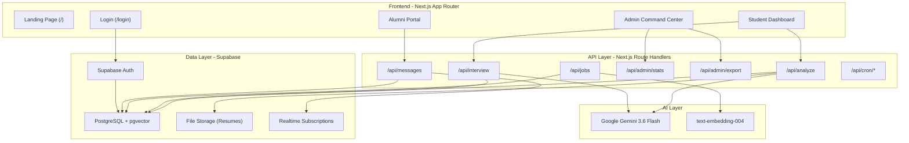
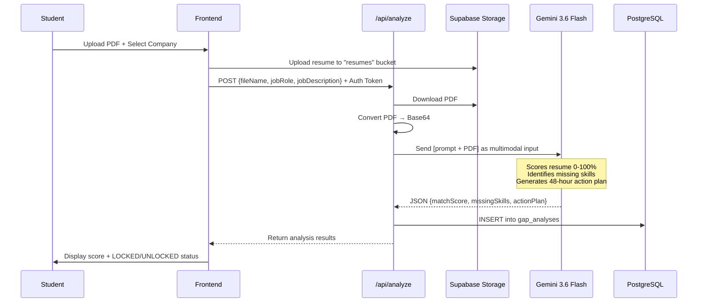
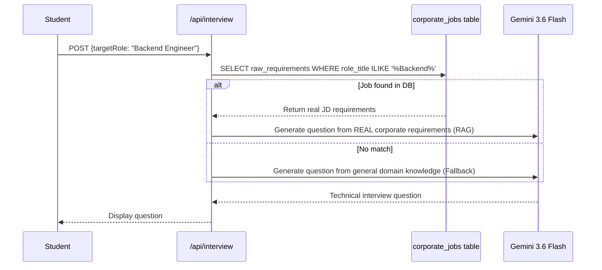

# IMED Placement OS — Complete Project Briefing
> **Prepared for**: Presentation to IMED Director  
> **Date**: September 9, 2026  
> **Project**: AI-Powered Campus Placement Intelligence Platform

---

## 1. Executive Summary (The Elevator Pitch)

**IMED Placement OS** is a full-stack, AI-powered placement management platform built specifically for **IMED, Bharati Vidyapeeth**. It uses **Google Gemini AI** to:

1. **Scan student resumes** against real corporate job descriptions and produce a quantified **match score (0-100%)**
2. **Conduct AI-powered mock interviews** (voice + chat) based on actual ingested corporate requirements
3. Give the **Placement Director a real-time Command Center** showing batch-wide readiness, skill gaps, at-risk students, and NAAC/NBA-exportable reports
4. **Connect alumni** for mentorship, referrals, and fundraising

> **In one line**: *"It's an ATS scanner + AI interviewer + placement analytics dashboard — all in one platform, custom-built for IMED."*

---

## 2. Technology Stack

| Layer | Technology | Purpose |
|-------|-----------|---------|
| **Frontend** | Next.js 15 (React 19) + TypeScript | App Router, SSR, server-side auth |
| **Styling** | Tailwind CSS + shadcn/ui + Radix UI | Premium dark-mode glassmorphism UI |
| **AI Engine** | Google Gemini (`gemini-3.6-flash`) | Resume analysis, interview Q&A, soft skills evaluation |
| **Embeddings** | Google `text-embedding-004` | Job description vectorization for semantic matching |
| **Database** | Supabase (PostgreSQL + pgvector) | Student/alumni/admin profiles, gap analyses, job vectors |
| **Auth** | Supabase Auth (email/password) | Role-based access (student, alumni, admin) |
| **File Storage** | Supabase Storage (`resumes` bucket) | PDF resume uploads |
| **Real-time** | Supabase Realtime (Postgres Changes) | Live chat messaging |
| **Charts** | Recharts | Data visualization in dashboards |
| **Deployment** | Vercel | Hosting + scheduled cron jobs |
| **Icons** | Lucide React | UI iconography |

---

## 3. Architecture Diagram



---

## 4. Database Schema (6 Core Tables + RLS)

| Table | Purpose | Key Columns |
|-------|---------|-------------|
| [`student_profiles`](file:///c:/AI%20agent%20project/imed-placement-os/schema.sql#L8-L16) | Registered students | `id`, `email`, `full_name`, `branch`, `batch_year` |
| [`alumni_profiles`](file:///c:/AI%20agent%20project/imed-placement-os/schema.sql#L18-L26) | Alumni network | `id`, `email`, `full_name`, `company`, `designation` |
| [`admin_profiles`](file:///c:/AI%20agent%20project/imed-placement-os/schema.sql#L28-L34) | Placement admins | `id`, `email`, `full_name`, `role` |
| [`gap_analyses`](file:///c:/AI%20agent%20project/imed-placement-os/schema.sql#L38-L45) | AI scan results | `student_id`, `match_score`, `missing_skills` (JSONB), `action_plan` |
| [`campus_drives`](file:///c:/AI%20agent%20project/imed-placement-os/schema.sql#L47-L52) | Upcoming placement drives | `title`, `status` (upcoming/active/completed) |
| [`action_plan_progress`](file:///c:/AI%20agent%20project/imed-placement-os/schema.sql#L54-L60) | Student remediation tracking | `analysis_id`, `is_completed`, `task_description` |

### Row-Level Security (RLS)
- **Students** can ONLY see their own data
- **Alumni** can ONLY see their own profiles
- **Admins** can see and manage ALL data
- A helper function [`is_admin()`](file:///c:/AI%20agent%20project/imed-placement-os/schema.sql#L77-L84) checks admin status at database level

---

## 5. Three User Portals

### 5.1 🎓 Student Portal (10 features)

| # | Feature | Route | What It Does |
|---|---------|-------|-------------|
| 1 | **Dashboard** | `/student` | Shows total scans, average match %, best score, readiness gauge, recent scan history |
| 2 | **AI Gap Analyzer** ⭐ | `/student/analyze` | Upload PDF resume → select a company from ingested DB or paste a manual JD → Gemini scores it 0-100% → outputs missing skills + 48-hour action plan |
| 3 | **Scan History** | `/student/history` | Full history of all past gap analyses with scores |
| 4 | **AI Voice Interview** | `/student/interview` | Live voice-based technical interview using Web Speech API + Gemini. Generates questions from real ingested corporate requirements (RAG) |
| 5 | **AI Chat Interview** | `/student/interview/chat` | Text-based mock interview with Gemini |
| 6 | **AI Resume Builder** | `/student/resume-builder` | AI-assisted resume creation |
| 7 | **Alumni Referrals** | `/student/referrals` | View job openings posted by IMED alumni |
| 8 | **Leaderboard** | `/student/leaderboard` | Ranking of students by match scores |
| 9 | **Soft Skills Analyzer** | `/student/soft-skills-analyzer` | Video/webcam analysis of communication and presentation skills |
| 10 | **AI Job Matches** | `/student/job-matches` | AI-recommended job openings based on resume profile |

### 5.2 🛡️ Admin Command Center (14 features)

| # | Feature | Route | What It Does |
|---|---------|-------|-------------|
| 1 | **Placement Intelligence Hub** | `/admin` | KPI dashboard: total students, total scans, ready count (≥75%), at-risk count (<75%), avg score, upcoming drives, predictive analytics |
| 2 | **Corporate Match Router** | `/admin/match-router` | Query DB for all students scoring ≥X% on a specific profile → generate exportable shortlist |
| 3 | **Cohort Skill Radar** | `/admin/skill-radar` | Aggregates ALL missing skills across the batch → identifies top 12 institutional skill gaps for targeted training |
| 4 | **Risk Telemetry** | `/admin/risk-telemetry` | Flags students scoring <75% who haven't completed their action plans. Shows remediation completion rate |
| 5 | **Campus Drives** | `/admin/drives` | Create and manage upcoming placement drives |
| 6 | **Job Ingestion** | `/admin/jobs` | Ingest corporate JDs → vectorized with `text-embedding-004` → stored in pgvector for AI matching |
| 7 | **Interview Logs** | `/admin/interviews` | View all AI interview sessions |
| 8 | **Student Management** | `/admin/students` | View and manage all student profiles |
| 9 | **NAAC/NBA Export** ⭐ | `/admin/export` | One-click CSV export of the entire placement report (summary metrics + skill deficits + student-wise telemetry) for NAAC/NBA accreditation |
| 10 | **Alumni Portal** | `/admin/alumni-tracking` | Track alumni engagement and mentorship |
| 11 | **Fundraising** | `/admin/fundraising` | Alumni donation campaigns management |
| 12 | **Predictive Analytics** | `/admin/predictive-analytics` | AI-forecasted placement trajectory (Day-1 hires, Day-2, at-risk %) |
| 13 | **Accreditation Reports** | `/admin/accreditation-reports` | Detailed reports for institutional accreditation |
| 14 | **Corporate Drive-Link** | `/admin/corporate-drive-link` | Share drive registration links with companies |

### 5.3 🎓 Alumni Portal (4 features)

| # | Feature | Route | What It Does |
|---|---------|-------|-------------|
| 1 | **Dashboard** | `/alumni` | Engagement score, mentorship status, profile details, upcoming IMED events |
| 2 | **Mentorship** | `/alumni/mentorship` | Opt-in to mentor current students |
| 3 | **Job Referrals** | `/alumni/referrals` | Post job openings from their company for students |
| 4 | **Donate to IMED** | `/alumni/donate` | Contribute to institutional campaigns |

---

## 6. Core AI Workflows (How the AI Actually Works)

### 6.1 AI Gap Analysis — The Crown Jewel



**Key detail**: Gemini receives the **entire PDF as Base64 inline data** — no text extraction library needed. The AI reads the PDF natively.

### 6.2 AI Interview (RAG Architecture)



> [!IMPORTANT]
> This is a **RAG (Retrieval-Augmented Generation)** architecture. Interview questions aren't generic — they're generated from **actual ingested corporate JDs** stored in the database. This makes interviews hyper-relevant to the companies visiting IMED.

### 6.3 Job Vectorization Pipeline

When an admin ingests a corporate JD:
1. The raw text is sent to Google's `text-embedding-004` model
2. It returns a **768-dimensional vector** (mathematical representation)
3. Both the raw text AND the vector are stored in Supabase (`pgvector`)
4. These vectors enable **semantic similarity matching** during gap analysis

---

## 7. API Routes Summary

| Endpoint | Method | Auth | Purpose |
|----------|--------|------|---------|
| [`/api/analyze`](file:///c:/AI%20agent%20project/imed-placement-os/app/api/analyze/route.ts) | POST | Student | Resume gap analysis with Gemini |
| [`/api/interview`](file:///c:/AI%20agent%20project/imed-placement-os/app/api/interview/route.ts) | POST | Student | Generate AI interview questions (RAG) |
| `/api/interview/respond` | POST | Student | Evaluate student's interview answer |
| `/api/interview/chat` | POST | Student | Chat-based interview |
| [`/api/jobs`](file:///c:/AI%20agent%20project/imed-placement-os/app/api/jobs/route.ts) | POST | Admin | Ingest + vectorize corporate JDs |
| `/api/jobs/scrape` | POST | Admin | Scrape LinkedIn JDs |
| [`/api/admin/stats`](file:///c:/AI%20agent%20project/imed-placement-os/app/api/admin/stats/route.ts) | GET | Admin | KPI data (overview, skill-radar, risk-telemetry, match-router) |
| [`/api/admin/export`](file:///c:/AI%20agent%20project/imed-placement-os/app/api/admin/export/route.ts) | GET | Admin | CSV export (roster + NAAC report) |
| `/api/admin/students` | GET | Admin | Student management data |
| `/api/admin/alumni` | GET | Admin | Alumni tracking data |
| [`/api/messages`](file:///c:/AI%20agent%20project/imed-placement-os/app/api/messages/route.ts) | GET/POST | All | Real-time chat messaging |
| `/api/action-plan` | PATCH | Student | Update action plan completion |
| `/api/student/leaderboard` | GET | Student | Leaderboard rankings |
| `/api/student/resume-builder` | POST | Student | AI resume building |
| `/api/student/analyze-video` | POST | Student | Soft skills video analysis |
| `/api/cron/sync-alumni` | GET | Cron | Monthly alumni data sync |
| `/api/cron/ingest-jobs` | GET | Cron | Weekly job ingestion |
| `/api/health` | GET | Public | Database health check |

---

## 8. Security Architecture

### Authentication Flow
1. Users sign in with **email + password** via Supabase Auth
2. On login, the system checks **3 profile tables** (`student_profiles` → `alumni_profiles` → `admin_profiles`) to determine role
3. Routes the user to the correct dashboard (`/student`, `/alumni`, or `/admin`)

### API Security
- **Server-side auth verification**: Every admin API checks `auth.getUser()` AND verifies the user exists in `admin_profiles`
- **RLS (Row-Level Security)**: PostgreSQL policies enforce data isolation at the database level
- **Service Role Key**: Used server-side only for admin operations that need cross-user data access
- **Bearer Tokens**: The analyze API receives the user's JWT for authenticated Supabase operations

### Key Security Boundaries

| Layer | Protection |
|-------|-----------|
| **Database** | RLS policies — students can ONLY read their own data |
| **API** | Auth verification + admin role check on every admin endpoint |
| **Client** | Supabase client uses anon key (limited permissions) |
| **Server** | Service role key (elevated permissions) kept server-side only |

---

## 9. Automated Scheduled Tasks (Cron Jobs)

Configured in [`vercel.json`](file:///c:/AI%20agent%20project/imed-placement-os/vercel.json):

| Schedule | Route | What It Does |
|----------|-------|-------------|
| **1st of every month** at midnight | `/api/cron/sync-alumni` | Syncs alumni data (e.g., LinkedIn profile updates) |
| **Every Monday** at 6 AM | `/api/cron/ingest-jobs` | Auto-ingests new corporate job postings |

---

## 10. UI/UX Design Philosophy

- **Dark theme** with glassmorphism (frosted glass effect)
- **Color system**: Cyan (primary), Indigo (secondary), Emerald (success/ready ≥75%), Rose/Amber (risk/locked <75%)
- **Collapsible sidebar** with role-specific navigation
- **Real-time notification bell** for drives, referrals, and mentorship updates
- **Live chat** between students and alumni with Supabase Realtime
- **Responsive** design for all screen sizes
- Custom animated background with gradient orbs and blur effects

---

## 11. File Structure Overview

```
imed-placement-os/
├── app/
│   ├── page.tsx                    # Landing page
│   ├── login/page.tsx              # Auth login
│   ├── layout.tsx                  # Root layout
│   ├── (dashboard)/
│   │   ├── layout.tsx              # Sidebar + nav (507 lines)
│   │   ├── student/               # 9 student pages
│   │   ├── admin/                 # 14 admin pages
│   │   └── alumni/                # 4 alumni pages
│   ├── api/                        # 17+ API routes
│   ├── auth/                       # Auth flows (signup, forgot-password, etc.)
│   └── drive/[token]/              # Dynamic drive registration
├── components/
│   ├── shared/                     # 10 reusable components
│   │   ├── ChatWindow.tsx          # Real-time messaging
│   │   ├── CompanySelector.tsx     # Job DB dropdown
│   │   ├── DataTable.tsx           # Data grid
│   │   ├── DragDropZone.tsx        # PDF upload
│   │   ├── ExportButton.tsx        # CSV download
│   │   ├── GlassCard.tsx           # Glassmorphism card
│   │   ├── NotificationBell.tsx    # Notifications
│   │   ├── ReadinessGauge.tsx      # Circular progress
│   │   └── StatCard.tsx            # KPI card
│   └── ui/                         # shadcn/ui primitives
├── lib/
│   ├── supabase/
│   │   ├── client.ts               # Browser-side Supabase (singleton)
│   │   ├── server.ts               # Server-side Supabase (cookie-based)
│   │   └── proxy.ts                # Proxy utilities
│   └── hooks/                      # Custom React hooks
├── scripts/                        # 15 setup/seed scripts
│   ├── seed-dummy-data.ts          # Populate test data
│   ├── master-seed.ts              # Full DB setup
│   ├── create-admin.ts             # Create admin accounts
│   └── setup-rls.sql               # RLS policy scripts
├── schema.sql                      # Full DB schema + RLS
├── vercel.json                     # Cron jobs config
└── package.json                    # Dependencies
```

---

## 12. Key Talking Points for the Director

### 🎯 Problem It Solves
> *"Currently, placement readiness is guesswork. We don't know which students are ready for which companies until the drive happens. This system quantifies readiness in advance."*

### 🤖 AI Differentiation
> *"Unlike generic placement portals, our system uses Google Gemini to read actual resumes as PDFs and score them against real corporate JDs. Interview questions come from the actual requirements the company posted — not a generic question bank."*

### 📊 Institutional Intelligence
> *"The admin dashboard gives the director a real-time view of which students are ready (≥75%), which are at-risk, and what skills the batch is missing as a whole. This data drives targeted training workshops."*

### 📋 NAAC/NBA Compliance
> *"One-click CSV export generates the full placement readiness report with all metrics NAAC requires — student-wise scores, batch-wide skill deficits, interview counts, and drive statistics."*

### 🔗 Alumni Engagement
> *"Alumni can post job referrals, mentor students, and donate — creating a self-sustaining ecosystem that improves placement outcomes year over year."*

### 🔒 Data Security
> *"Row-Level Security ensures students can only see their own data. Admin APIs verify admin identity server-side before returning any cross-user data."*

### 📈 Predictive Analytics
> *"The system forecasts Day-1 corporate placement rates, Day-2 rates, and at-risk percentages based on current cohort capabilities and historical drive difficulty."*

---

## 13. What Makes This Unique vs. Competitors

| Feature | Generic Placement Portals | IMED Placement OS |
|---------|--------------------------|-------------------|
| Resume Scoring | Manual review | AI-powered 0-100% match with Gemini |
| Interview Prep | Static question banks | RAG-based questions from real corporate JDs |
| Skill Gap Analysis | None | Per-student + batch-wide radar |
| Action Plans | None | AI-generated 48-hour remediation plans |
| NAAC Reports | Manual compilation | One-click automated export |
| Risk Detection | None | Real-time at-risk student flagging |
| Alumni Integration | Separate system | Built-in mentorship + referrals + donations |
| Job Vectorization | Keyword matching | pgvector semantic embeddings |

---

> [!TIP]
> **For the demo**: The best flow to show is: Login as Student → Upload a PDF resume → Select a company → Watch the AI score it → Show the missing skills + action plan → Then switch to Admin view to show the batch-wide radar and NAAC export.
